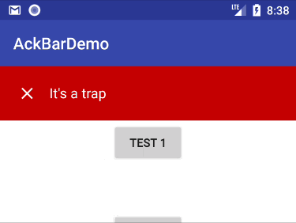
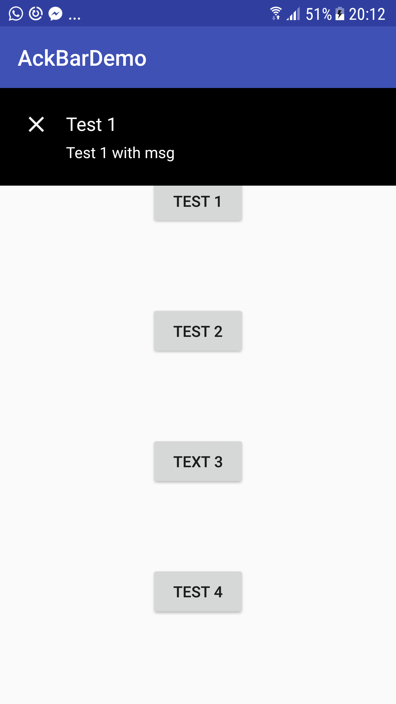
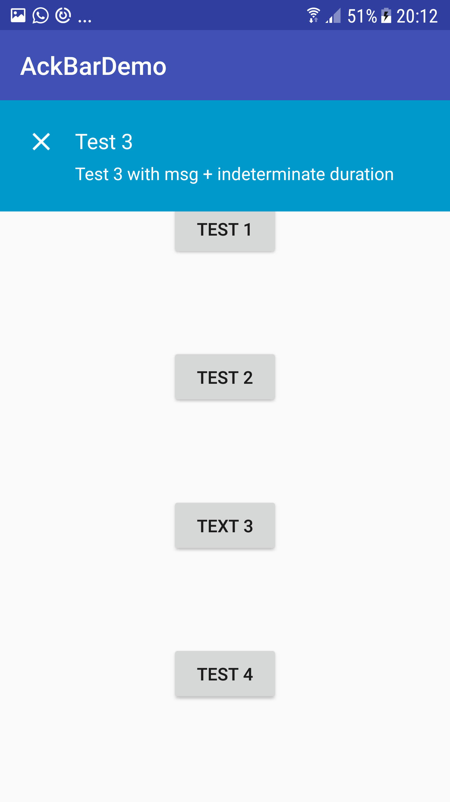
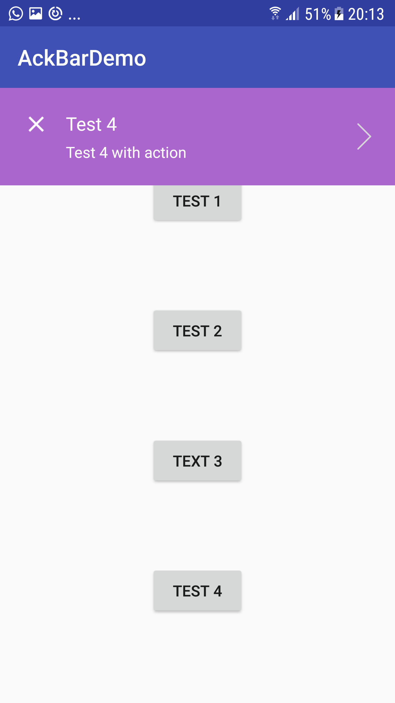

# AckBar
AckBar is simple, lightweight and customizable Android library to display in-app notifications.

* Show a message on top of the screen for a fixed period of time or make it sticky
* Queue message
* Add action to your notifications
* Add an additional message body
* Customize the message color

# How to
create your AckBar object:
```java
final AckBar ackBar = AckBar.make(MainActivity.this, R.string.test_1, android.R.color.black, 5000);
```
@optional
set a message body
```java
ackBar.setMsg(R.string.test_1_msg);
```

@optional
set an action
```java
 ackBar.setAction(new Runnable() {
  @Override
  public void run() {
     Toast.makeText(MainActivity.this, "Action", Toast.LENGTH_LONG).show();
  }
 });
 ```
 show
 ```java
 ackBar.show();
 ```
 dismiss
 ```java
 ackBar.dismiss();
 ```

# Download

add the repo on your root build.gradle file

```groovy
allprojects {
    repositories {
         maven {
            url "https://dl.bintray.com/murielk/maven/"
        }
    }
}
```

now add  the dependency on your project build.gradle file
```groovy
compile 'com.murielkamgang:AckBar:1.0.1'
```
# Screenshots





# License

> Licensed under the Apache License, Version 2.0 (the "License");
> you may not use this work except in compliance with the License.
> You may obtain a copy of the License in the LICENSE file, or at:
>
>  [http://www.apache.org/licenses/LICENSE-2.0](http://www.apache.org/licenses/LICENSE-2.0)
>
> Unless required by applicable law or agreed to in writing, software
> distributed under the License is distributed on an "AS IS" BASIS,
> WITHOUT WARRANTIES OR CONDITIONS OF ANY KIND, either express or implied.
> See the License for the specific language governing permissions and
> limitations under the License.


