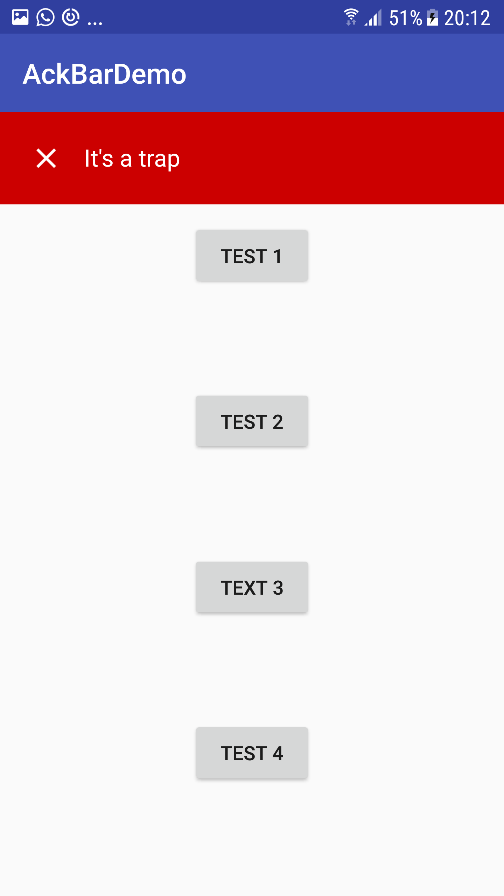

# AckBar
AckBar is a very lightweight and customizable android library to display brief message to user.

* Show a message on top of the screen for a fixed period of time or make it sticky
* Queue message
* Add action to your message
* Add an additional message body
* Customize the message color

# How to
create your AckBar object:
```java
final AckBar ackBar = AckBar.make(MainActivity.this, R.string.test_1, android.R.color.black, 5000);
```
@optional
set a message body
```java
ackBar.setMsg(R.string.test_1_msg);
```

@optional
set an action
```java
 ackBar.setAction(new Runnable() {
  @Override
  public void run() {
     Toast.makeText(MainActivity.this, "Action", Toast.LENGTH_LONG).show();
  }
 });
 ```
 show
 ```java
 ackBar.show();
 ```
 dismiss
 ```java
 ackBar.dismiss();
 ```

# Download
get it via Gradle:
```groovy
compile 'com.murielkamgang:AckBar:1.0.0'
```
# Screenshots



